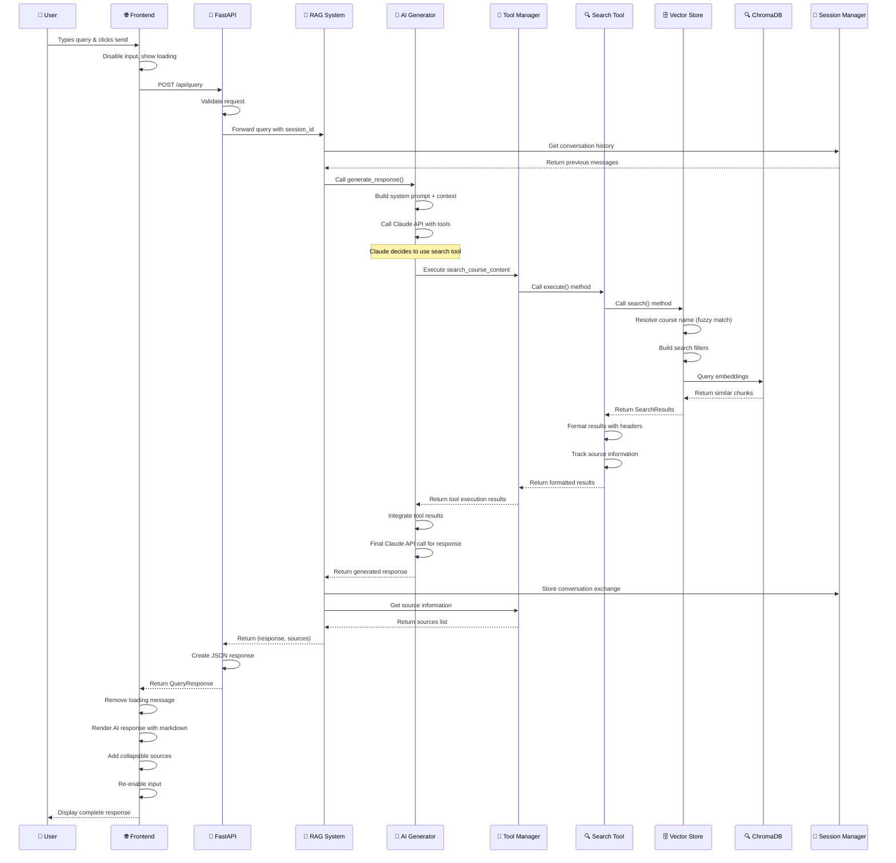
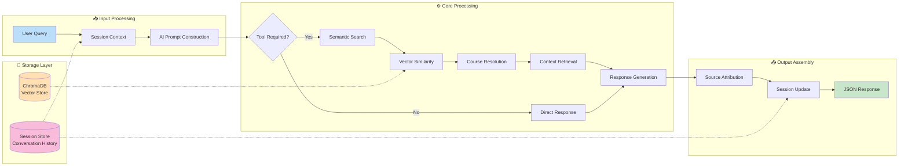
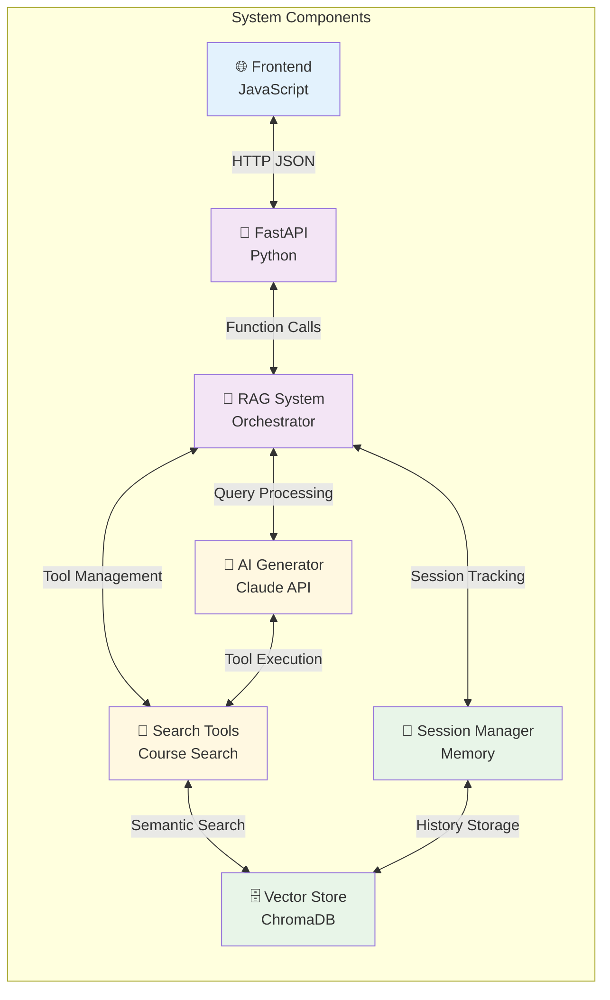

# RAG Chatbot Query Processing Flow - Mermaid Diagram

## Complete System Architecture Flow

```mermaid
graph TD
    %% Frontend Layer
    subgraph Frontend ["🌐 Frontend (script.js)"]
        UI1[👤 User Input] --> UI2[📝 Text Input Field]
        UI2 --> UI3[🔘 Send Button Click]
        UI3 --> UI4[⚡ Event Listener]
        UI4 --> UI5[🔄 UI State Management]
        UI5 --> UI6[❌ Disable Input]
        UI5 --> UI7[⏳ Show Loading]
        UI5 --> UI8[💬 Add User Message]
        UI8 --> HTTP1[📡 HTTP POST Request]
    end

    %% HTTP Request
    HTTP1 --> |POST /api/query<br/>{"query": "...", "session_id": "..."}| FastAPI1

    %% FastAPI Layer
    subgraph FastAPI ["🚀 FastAPI Server (app.py)"]
        FastAPI1[📨 Request Reception<br/>@app.post('/api/query')] --> FastAPI2[🔑 Session Management]
        FastAPI2 --> FastAPI3{Session ID exists?}
        FastAPI3 -->|No| FastAPI4[🆕 Create New Session]
        FastAPI3 -->|Yes| FastAPI5[📋 Use Existing Session]
        FastAPI4 --> FastAPI6[🎯 Forward to RAG System]
        FastAPI5 --> FastAPI6
    end

    FastAPI6 --> |rag_system.query(query, session_id)| RAG1

    %% RAG System Layer
    subgraph RAGSystem ["🧠 RAG System (rag_system.py)"]
        RAG1[📝 Query Processing Entry] --> RAG2[📚 Retrieve Conversation History]
        RAG2 --> RAG3[🔧 Prepare Tool Definitions]
        RAG3 --> RAG4[🤖 Call AI Generator]
    end

    RAG4 --> |generate_response()| AI1

    %% AI Generator Layer
    subgraph AIGenerator ["🤖 AI Generator (ai_generator.py)"]
        AI1[🧩 Build System Prompt + Context] --> AI2[🔗 Claude API Call]
        AI2 --> AI3{Tool Usage Required?}
        AI3 -->|No| AI4[📤 Return Direct Response]
        AI3 -->|Yes| AI5[🛠️ Handle Tool Execution]
    end

    AI5 --> |execute_tool()| TOOL1

    %% Tool Execution Layer
    subgraph ToolExecution ["🔧 Tool Execution (search_tools.py)"]
        TOOL1[🛠️ Tool Manager] --> TOOL2[🔍 Course Search Tool]
        TOOL2 --> TOOL3[📋 Tool Definition:<br/>search_course_content]
        TOOL3 --> TOOL4[⚡ Execute Search]
    end

    TOOL4 --> |store.search()| VECTOR1

    %% Vector Store Layer
    subgraph VectorStore ["🗄️ Vector Store (vector_store.py)"]
        VECTOR1[🎯 Smart Search Process] --> VECTOR2[📝 Course Name Resolution]
        VECTOR2 --> VECTOR3[🔍 Fuzzy Match Course Names]
        VECTOR3 --> VECTOR4[🏗️ Build Search Filters]
        VECTOR4 --> VECTOR5[🧮 ChromaDB Vector Search]
        VECTOR5 --> VECTOR6[📊 Return Search Results]
    end

    VECTOR6 --> |SearchResults| FORMAT1

    %% Result Formatting
    subgraph ResultFormatting ["🔄 Response Assembly"]
        FORMAT1[📝 Format Search Results] --> FORMAT2[🏷️ Add Course/Lesson Headers]
        FORMAT2 --> FORMAT3[📚 Track Source Information]
        FORMAT3 --> FORMAT4[📤 Return Formatted Results]
    end

    FORMAT4 --> |Tool Results| AI6

    %% Final AI Response
    subgraph FinalResponse ["🤖 Final AI Response Generation"]
        AI6[🔧 Integrate Tool Results] --> AI7[🎯 Final Claude API Call]
        AI7 --> AI8[📝 Generate Natural Language Response]
    end

    AI8 --> |response, sources| SESSION1

    %% Session Management
    subgraph SessionMgmt ["📝 Session & History Management"]
        SESSION1[💾 Store Conversation] --> SESSION2[🏷️ Track Sources]
        SESSION2 --> SESSION3[📤 Return Response + Sources]
    end

    SESSION3 --> |return (response, sources)| FastAPI7

    %% FastAPI Response
    subgraph FastAPIResponse ["📤 FastAPI Response"]
        FastAPI7[🚀 Create QueryResponse] --> FastAPI8[📡 HTTP JSON Response]
    end

    FastAPI8 --> |JSON Response| Frontend2

    %% Frontend Response Handling
    subgraph FrontendResponse ["🎨 Frontend Response Handling"]
        Frontend2[📨 Receive JSON Response] --> Frontend3[🔄 Update Session ID]
        Frontend3 --> Frontend4[🗑️ Remove Loading Message]
        Frontend4 --> Frontend5[📝 Render AI Response]
        Frontend5 --> Frontend6[🔗 Add Sources Section]
        Frontend6 --> Frontend7[📜 Auto-scroll Chat]
        Frontend7 --> Frontend8[✅ Re-enable Input]
    end

    %% Styling
    classDef frontend fill:#e1f5fe
    classDef fastapi fill:#f3e5f5
    classDef rag fill:#e8f5e8
    classDef ai fill:#fff3e0
    classDef tool fill:#fce4ec
    classDef vector fill:#f1f8e9
    classDef format fill:#e0f2f1
    classDef session fill:#f9fbe7

    class UI1,UI2,UI3,UI4,UI5,UI6,UI7,UI8,HTTP1,Frontend2,Frontend3,Frontend4,Frontend5,Frontend6,Frontend7,Frontend8 frontend
    class FastAPI1,FastAPI2,FastAPI3,FastAPI4,FastAPI5,FastAPI6,FastAPI7,FastAPI8 fastapi
    class RAG1,RAG2,RAG3,RAG4 rag
    class AI1,AI2,AI3,AI4,AI5,AI6,AI7,AI8 ai
    class TOOL1,TOOL2,TOOL3,TOOL4 tool
    class VECTOR1,VECTOR2,VECTOR3,VECTOR4,VECTOR5,VECTOR6 vector
    class FORMAT1,FORMAT2,FORMAT3,FORMAT4 format
    class SESSION1,SESSION2,SESSION3 session
```

## Detailed Tool Execution Flow



## Data Flow Architecture



## Component Interaction Matrix



## Error Handling Flow

```mermaid
flowchart TD
    A[User Query] --> B{Frontend Validation}
    B -->|Invalid| C[Show Error Message]
    B -->|Valid| D[Send to Backend]
    
    D --> E{API Validation}
    E -->|Invalid| F[Return 400 Error]
    E -->|Valid| G[Process with RAG]
    
    G --> H{RAG Processing}
    H -->|Error| I[Return 500 Error]
    H -->|Success| J{Tool Execution}
    
    J -->|Tool Error| K[Return Error Message]
    J -->|Success| L{Vector Search}
    
    L -->|No Results| M[Return "No content found"]
    L -->|Success| N[Generate Response]
    
    F --> O[Frontend Error Display]
    I --> O
    K --> O
    C --> P[User Sees Error]
    M --> Q[User Sees No Results Message]
    N --> R[User Sees Successful Response]
    O --> P

    classDef error fill:#ffebee
    classDef success fill:#e8f5e8
    classDef warning fill:#fff3e0

    class C,F,I,K,O,P error
    class N,R success
    class M,Q warning
```